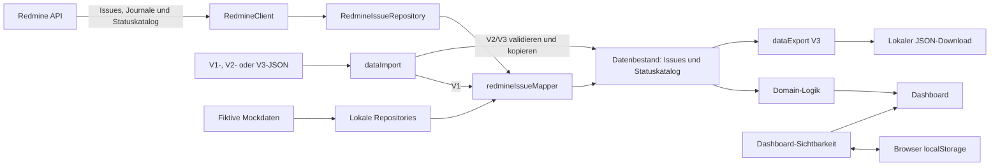

# Datenkrake

## Überblick

Datenkrake ist eine lokale React-Anwendung zur Auswertung von Redmine-Issues.
Sie übernimmt Daten direkt aus der Redmine-API oder aus einer lokalen
Datenkrake-JSON-Datei, reduziert sie auf ein internes Modell und berechnet
daraus Flow-Metriken und Dashboard-Visualisierungen.

Die Anwendung richtet sich an Entwickler, Agilisten und interne Reviewer, die
Ticketfluss, Durchlaufzeiten und Statushistorien untersuchen wollen. Sie ersetzt
weder Redmine als führendes System noch dessen Benutzer- und
Berechtigungsverwaltung.

## Datenschutz und Datenminimierung

### Lokale Verarbeitung

Redmine-Daten werden für die Auswertung im Browser verarbeitet. Für die
Dashboard-Daten verwendet Datenkrake weder eine eigene Datenbank noch einen
Cloudspeicher. Lokale Datenkrake-Dateien werden über Browser-APIs eingelesen
und als Download erzeugt. Davon getrennt wird die Auswahl sichtbarer
Dashboard-Bereiche im `localStorage` des Browsers gespeichert.

### Minimales Domain-Modell

Redmine-API-Antworten werden beim Übergang in das interne Domain-Modell
unmittelbar reduziert. Dieses enthält nur Ticket-ID und Betreff, aktuellen
Status mit ID, Name und `is_closed`, Erstell- und optionalen Abschlusszeitpunkt
sowie Journal-ID, Zeitpunkt und alte/neue Status-ID benötigter Statuswechsel.

Nicht übernommen werden insbesondere Projekt, Tracker, Priorität, Autor,
Bearbeiter, Beschreibung, Journalbenutzer, Journalnotizen einschließlich
privater Notizen, Custom Fields, Planungsdaten, Fortschrittswerte, Schätz- und
Stundenwerte sowie sonstige nicht benötigte Redmine-Metadaten.

### Datenkrake-JSON-Format

Neue Exporte verwenden ausschließlich das minimierte Datenkrake-Format V3 und
keinen vollständigen Redmine-API-Dump. V1-Dateien können weiterhin importiert
werden. Ihre Redmine-nahen Daten werden beim Import auf das minimale Modell
abgebildet; zusätzliche V1-Informationen leben danach nicht im aktiven
Datenbestand weiter. V1 und V2 enthalten noch keinen eigenen Statuskatalog und
verwenden deshalb beim Import den gebündelten Legacy-Katalog.

### API-Key und sichere Verbindung

Der Redmine-API-Key wird nur als Header für Redmine-Anfragen verwendet. Er liegt
während Eingabe und Zugriff im React-Zustand, wird nach jedem Ladeversuch daraus
entfernt, nicht in `localStorage` gespeichert, nicht exportiert und nicht in
Fehlermeldungen ausgegeben.

Redmine-Basis-URLs werden zentral mit der nativen `URL`-API validiert. Zulässig
sind nur syntaktisch gültige HTTPS-URLs mit Host und ohne eingebetteten
Benutzernamen oder Passwort. Ungültige URLs werden vor einem möglichen
Netzwerkzugriff abgelehnt. Eine allgemeine oder lokale HTTP-Ausnahme existiert
nicht.

### Private Redmine-Issues

Private Redmine-Issues werden nicht zusätzlich durch Datenkrake
herausgefiltert. Redmine bleibt die maßgebliche Berechtigungsgrenze:
Datenkrake kann nur Issues verarbeiten, die der verwendete Redmine-Benutzer
aufgrund seiner Berechtigungen und des gewählten Filters abrufen kann. Eine
zusätzliche Berechtigungslogik für private Issues existiert nicht.

Abrufbare private Issues werden wie alle anderen Issues auf das minimale Modell
reduziert. Diese Entscheidung erhält zugleich die fachliche Konsistenz der
Flow-Metriken. Ein zusätzliches Herausfiltern könnte etwa Throughput, WIP und
Cycle Time gegenüber dem ausgewählten Redmine-Datenbestand verfälschen.

## Architektur und Datenfluss

Die Anwendung trennt Transport, Datenzugriff, Mapping, Domain-Logik und UI:

- `src/redmine/types.ts` beschreibt erwartete Redmine-Transportdaten.
- `RedmineClient` validiert Antworten, paginiert die Issue-Liste und lädt für
  jedes Issue die Detailansicht mit Journalen.
- `RedmineIssueRepository` kapselt Client und Query hinter dem allgemeinen
  `IssueRepository`.
- `redmineIssueMapper` bildet Transportdaten auf das minimale `Issue` aus
  `src/data/types.ts` ab. Hier liegt die Grenze zum internen Modell.
- Die Module unter `src/domain` rekonstruieren Statusphasen und berechnen
  Metriken ohne HTTP- oder React-Abhängigkeit.
- Dashboard-Komponenten bereiten Ergebnisse für Kennzahlen, Tabellen und
  Diagramme auf.
- `dataImport` validiert V1/V2/V3 und reduziert V1 beim Einlesen; `dataExport`
  erzeugt ausschließlich V3.
- `dashboardVisibility` speichert nur die Sichtbarkeit der Bereiche im Browser.
- Beim Start liefern lokale Repositories fiktive Mock-Issues und den daraus
  abgeleiteten Statuskatalog. Beide bilden gemeinsam den Mock-Datenbestand.



Der Referenzzeitpunkt wird beim initialen Laden und nach einem erfolgreichen
Import oder Redmine-Abruf mit `Date.now()` gesetzt. Er bleibt für den aktiven
Datenbestand stabil, bis eine neue Datenquelle übernommen wird.

## Installation und lokaler Betrieb

Vorausgesetzt werden Node.js und npm. Das Repository legt keine
`engines`-Version fest; die CI verwendet Node.js 24.

```sh
npm ci
npm run dev
```

| Zweck                                   | Befehl                  |
| --------------------------------------- | ----------------------- |
| Entwicklungsserver                      | `npm run dev`           |
| TypeScript-Prüfung und Produktionsbuild | `npm run build`         |
| Lokale Vorschau                         | `npm run preview`       |
| Tests im Vitest-Modus                   | `npm test`              |
| Einmaliger Testlauf                     | `npm run test:run`      |
| Tests mit V8-Coverage                   | `npm run test:coverage` |
| ESLint                                  | `npm run lint`          |
| Mit Prettier formatieren                | `npm run format`        |
| Formatierung prüfen                     | `npm run format:check`  |

Der Vite-Entwicklungsserver dient die Browseranwendung lokal aus. Ein lokaler
Redmine-Zugriff über HTTP wird dadurch nicht freigeschaltet.

## Redmine-Anbindung

- **Basis-URL:** zum Beispiel `https://redmine.example.test` oder eine
  Installation unter einem Pfad; nur HTTPS ohne eingebettete Zugangsdaten.
- **API-Key:** wird als `X-Redmine-API-Key` gesendet.
- **Query-Parameter:** werden als Query für `GET /issues.json` übernommen.
  Mehrfachwerte bleiben erhalten. `limit` und `offset` steuern die Pagination;
  ohne `limit` werden Seiten mit 100 Issues angefordert.

Der Client lädt zuerst alle Seiten der Issue-Liste. Danach fordert er für jedes
Issue `GET /issues/:id.json?include=journals` an. Journale sind nötig, weil die
Listenantwort keine vollständige Statushistorie enthält. Nur Journaldetails mit
einer vollständigen Änderung von `status_id` gelangen in das Domain-Modell.
Parallel lädt der Client `GET /issue_statuses.json`. Aus der Antwort werden nur
Status-ID, Name und `is_closed` übernommen. Scheitert dieser Abruf oder ist die
Antwort ungültig, wird der gesamte Redmine-Ladevorgang abgebrochen.

Der Nutzer muss Filter wählen, die den fachlich gewünschten Datenbestand und
einen praktikablen Umfang ergeben. Datenkrake ergänzt keinen eigenen Projekt-,
Zeitraum-, Status- oder Privatheitsfilter. Netzwerkfehler können auch entstehen,
wenn die Redmine-Instanz direkten Browserzugriff durch CORS verhindert.

## Datenkrake-Dateiformat

Ein Export besitzt die Formatkennung `datenkrake`, Version `3` und einen
ISO-Zeitstempel `exportedAt`. Dieser dokumentiert den Erzeugungszeitpunkt und
wird beim Import validiert; er ist nicht der Referenzzeitpunkt der
Dashboard-Berechnungen.

```json
{
  "format": "datenkrake",
  "version": 3,
  "exportedAt": "2026-08-29T10:00:00.000Z",
  "statusDefinitions": [
    { "id": 1, "name": "New", "is_closed": false },
    { "id": 20, "name": "Refined", "is_closed": false },
    { "id": 50, "name": "Done", "is_closed": true }
  ],
  "issues": [
    {
      "id": 42,
      "subject": "Fiktives Beispiel-Ticket",
      "status": { "id": 50, "name": "Done", "is_closed": true },
      "created_on": "2026-08-01T08:00:00Z",
      "closed_on": "2026-08-04T12:00:00Z",
      "journals": [
        {
          "id": 7,
          "created_on": "2026-08-02T09:00:00Z",
          "details": [
            {
              "property": "attr",
              "name": "status_id",
              "old_value": "1",
              "new_value": "20"
            },
            {
              "property": "attr",
              "name": "status_id",
              "old_value": "20",
              "new_value": "50"
            }
          ]
        }
      ]
    }
  ]
}
```

Der Browser liest Dateien mit der File-API. Der Import prüft Formatkennung,
Version, Zeitstempel und Struktur. V3 lehnt zusätzliche Issue-, Status-,
Statusdefinitions-, Journal- und Detailfelder ab. Der Export erzeugt
`datenkrake_YYYY_MM_DD.json` und kopiert erneut nur das minimale Modell. V1
und V2 bleiben lesbar, werden aber nicht mehr erzeugt. Nur V3 trägt den zum
Datenbestand gehörenden Statuskatalog und kann ihn beim Roundtrip unabhängig
von der ursprünglichen Redmine-Instanz wiederherstellen.

## Metriken und fachliche Definitionen

Alle Zeitberechnungen basieren auf der rekonstruierten Statushistorie.
Verwertbare Änderungen brauchen positive numerische alte und neue Status-IDs,
einen gültigen Zeitpunkt und eine konsistente Kette zum aktuellen Status.
Änderungen vor Issue-Erstellung sowie ungültige, identische oder inkonsistente
Wechsel werden verworfen.

### Cycle Time

Cycle Time beginnt beim ersten Eintritt in den eindeutig definierten Status mit
dem exakten Namen `Refined` und endet beim ersten anschließenden Eintritt in den
eindeutig definierten Status `Done`. Fehlt im aktiven Katalog genau eine dieser
Definitionen oder erreicht ein Issue `Refined` nicht, gibt es kein Ergebnis.

Ohne Eintritt in `Done` läuft die Cycle Time bis zum Referenzzeitpunkt. Ein
fehlender oder ungültiger Referenzzeitpunkt ergibt keine Dauer; negative Dauern
werden nicht ausgegeben. Bei abgeschlossenen aktuellen Phasen begrenzt ein
plausibles `closed_on` die Verweilzeit.

### Cycle-Time-Kennzahlen und Visualisierungen

- **Übersicht:** zählt berechenbare abgeschlossene und laufende Cycle Times.
  Median, P85 und P95 verwenden nur gültige, nicht negative abgeschlossene
  Dauern.
- **Perzentile:** sortieren die Werte und interpolieren linear zwischen
  benachbarten Rängen; der Rang ist `(Anzahl - 1) × Perzentil`.
- **Verteilung:** teilt Dauern zwischen Minimum und Maximum in höchstens acht
  gleich breite Klassen. Die Anzahl folgt `ceil(log2(n) + 1)`, maximal acht;
  identische Dauern bilden eine Klasse.
- **Verlauf:** zeigt jede gültige abgeschlossene Cycle Time am Eintritt in
  `Done`, chronologisch sortiert.

### Throughput

Throughput zählt Issues beim ersten Eintritt in `Done` nach Cycle-Time-Beginn.
Die Zuordnung erfolgt in UTC zu ISO-Wochen von Montag bis Sonntag. Zwischen
erster und letzter belegter Woche erscheinen auch Wochen mit null Abschlüssen.
Die Verteilung zeigt Wochenanzahl, Summe, arithmetisches Mittel und Median der
Wochenwerte; der Median nutzt die lineare 50-Prozent-Perzentilberechnung.

### Work in Progress

- **Historischer WIP:** Ein Issue zählt ab Cycle-Time-Start einschließlich. Das
  Ende abgeschlossener Cycle Times ist exklusiv; laufende Intervalle zählen bis
  einschließlich Referenzzeitpunkt. Gemessen wird je UTC-Kalendertag um 00:00
  Uhr vom frühesten Starttag bis zum letzten relevanten End-/Referenztag.
- **Aktueller WIP nach Status:** zählt Issues mit laufender Cycle Time nach
  aktuellem Status. Die Reihenfolge folgt dem aktiven Statuskatalog, unbekannte
  Status folgen nach ID.
- **Aging WIP:** enthält laufende Cycle Times mit gültiger Dauer, absteigend
  nach Alter am Referenzzeitpunkt; bei Gleichstand folgen ID und Betreff.

### Statusverweilzeiten

Statusverweilzeiten summieren je Issue abgeschlossene Besuche eines Status. Für
die aktuelle offene Phase wird die Dauer bis zum optionalen Referenzzeitpunkt
ergänzt und auf mindestens null begrenzt. Jede gültige Besuchsdauer bleibt für
die Aggregation erhalten.

Die aggregierte Ansicht berechnet je Status Anzahl, arithmetisches Mittel und
Median aller Besuchsdauern. Bei ungerader Anzahl ist der Median der mittlere
Wert, bei gerader der Mittelwert der zwei mittleren Werte.

## Dashboard-Konfiguration

Ein- und ausblendbar sind Basiskennzahlen, Cycle-Time-Übersicht, -Verteilung und
-Verlauf, Throughput und dessen Verteilung, historischer WIP, Aging WIP,
aktueller WIP nach Status, aggregierte Statusverweilzeiten und Ticketdetails.

Alle Bereiche sind standardmäßig sichtbar. Die Auswahl wird unter
`datenkrake.dashboard.visibility` im Browser-`localStorage` gespeichert.
Ungültige, unvollständige oder nicht speicherbare Werte fallen auf die Vorgabe
zurück beziehungsweise beeinträchtigen das Dashboard nicht. „Standard
wiederherstellen“ aktiviert alle definierten Bereiche.

## Qualitätssicherung

- **Tests:** Vitest läuft in `jsdom`; React-Komponenten werden mit Testing
  Library und `jest-dom` geprüft.
- **Coverage:** `npm run test:coverage` erzeugt V8-Textausgabe und
  `coverage/lcov.info`. Tests, Setup, Mockdaten und Assets sind aus der
  Produktions-Coverage ausgeschlossen.
- **Statische Prüfungen:** ESLint prüft TypeScript und React-Regeln. Der Build
  führt TypeScript-Projektbuild und Vite-Build aus. Prettier prüft den Stil.
- **SonarQube Cloud:** GitHub Actions analysiert Pushes nach `main` und Pull
  Requests aus demselben Repository mit Coverage. Kennungen und Token kommen
  aus GitHub-Variablen und Secrets; Pull Requests aus Forks werden übersprungen.

SonarQube ergänzt Tests und statische Analyse, ist aber keine vollständige
Sicherheits- oder Datenschutzprüfung. Die GitHub-Integration kann einen
Quality-Gate-Check veröffentlichen. Ob dieser das Mergen blockiert, hängt von
extern konfigurierter Branch Protection oder einem Ruleset ab. Details stehen
in [`docs/sonar.md`](docs/sonar.md).

## Bekannte Einschränkungen

- **Statusnamen:** Cycle Time setzt im zum Datenbestand gehörenden Statuskatalog
  exakt je einen Status `Refined` und `Done` voraus. Abweichende Namen oder
  mehrdeutige Definitionen liefern keine Cycle Time. Legacy-Dateien V1/V2
  besitzen keinen eigenen Katalog und verwenden weiterhin die gebündelten
  Definitionen.
- **Journaldaten:** Vollständige Metriken hängen von erreichbaren und
  konsistenten Statusjournalen ab. Fehlende, ungültige oder widersprüchliche
  Wechsel werden verworfen und können Historien verkürzen.
- **Abrufaufwand:** Nach der paginierten Liste folgt pro Issue eine
  Detailanfrage. Es gibt keine explizite Obergrenze; Filter und Umfang bestimmen
  Laufzeit, Browserlast und Request-Anzahl.
- **CORS:** Direkter Zugriff funktioniert nur, wenn Redmine Browseranfragen
  zulässt. Es gibt keinen Backend-Proxy.
- **Filterqualität:** Datenkrake bewertet nicht, ob ein Filter vollständig oder
  repräsentativ ist. Metriken beziehen sich nur auf den geladenen Bestand.
- **Lokaler Zustand:** Dashboard-Daten liegen im React-Zustand. Ein Neuladen
  startet wieder mit Mockdaten; dauerhafte Übernahme erfordert einen lokalen
  Export.
- **Berechtigungen:** Datenkrake besitzt keine Benutzerkonten, Rollen oder
  Issue-Berechtigungen; es gelten die Rechte des API-Key-Benutzers.
- **Fachliche Festlegung:** `Refined` und `Done` sind im Code festgelegt und
  nicht über die UI konfigurierbar.
